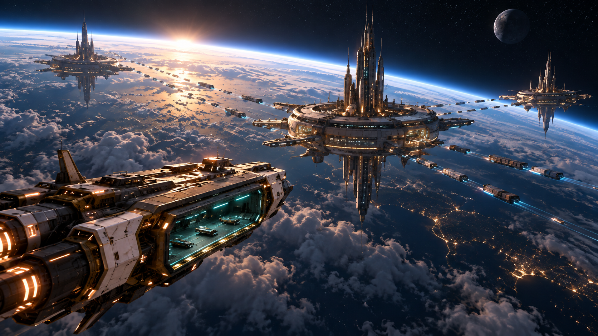
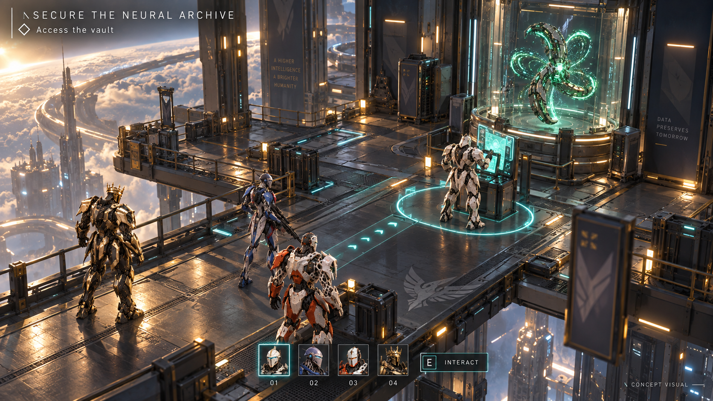
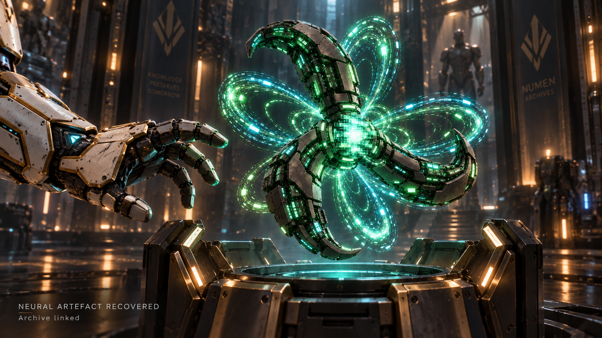
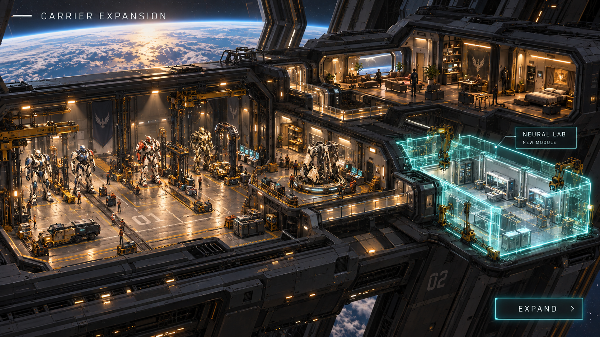
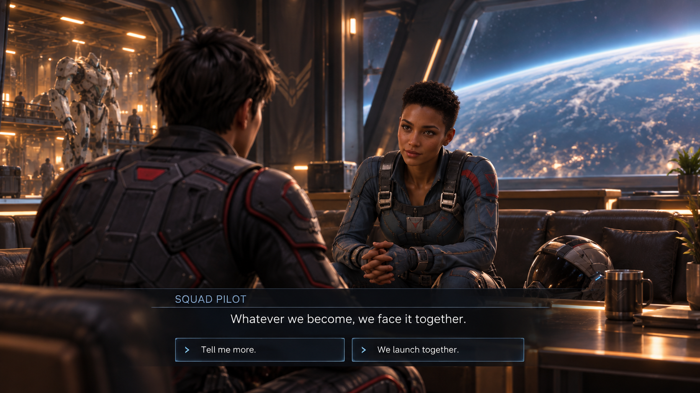
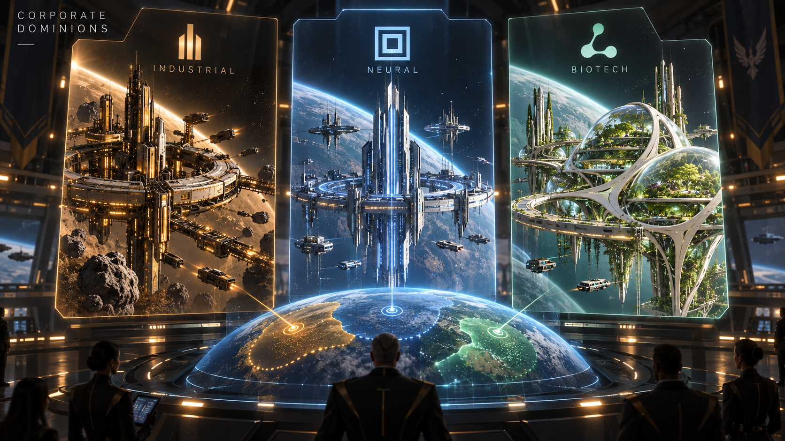
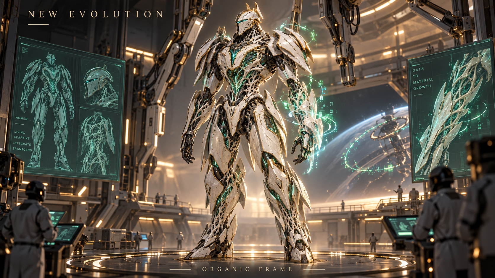
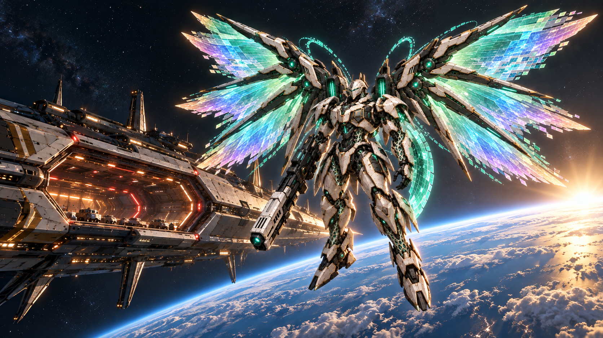

# Missing video shots — first proposals

Eight static concept images generated with the built-in image generation tool. Mission objective, pilot dialogue, faction archetypes, carrier modules and organic evolution are proposals for review, not finalized mechanics or actual gameplay footage.

## pitch-01-galaxy-opening-v1

References: numen-cockpit-space-carrier-v3.png

Single cinematic 16:9 widescreen pitch storyboard still, premium 3D CGI soft shading matching Project Phoenix references, ivory and brushed gold engineering, graphite interiors, teal neural light, warm amber practical lighting. Original sci-fi universe, no recognizable franchise symbols, no combat violence or explosions. Deliberate focal point, readable silhouettes, restrained effects, no watermark. Space establishing shot: immense cloud-covered blue planet with curved glowing atmospheric horizon, night-side lights, a smaller distant moon and black space. Three enormous corporate orbital facilities and organized luminous shipping lanes suggest concentrated control of resources. One elegant utilitarian spaceship carrier approaches from lower left, dark charcoal hull, ivory armor segments and gold structural details, distinctive elongated hexagonal launch bay glowing teal. Wide awe-inspiring cinematic composition with much negative space, restrained sunrise on planet edge. No text, UI, map labels or logo. Reference is palette and orbital planet continuity only, do not reproduce cockpit.

## pitch-05-mission-concept-v1

References: squad-selection-concept-v1.png, neural-artefact-02.png

Single cinematic 16:9 widescreen pitch storyboard still, premium 3D CGI soft shading matching Project Phoenix references, ivory and brushed gold engineering, graphite interiors, teal neural light, warm amber practical lighting. Original sci-fi universe, no recognizable franchise symbols, no combat violence or explosions. Deliberate focal point, readable silhouettes, restrained effects, no watermark. Proposed squad RPG MISSION screen, elevated three-quarter tactical camera showing all FOUR Numens from reference 1 at smaller gameplay scale exploring a corporate data-vault platform above a planet. Preserve their identities: ivory gold base knight, slender blue/crimson sniper with lowered rifle, orange ivory partially unarmored synthetic-frame knight, black gold crowned knight. No wing upgrades yet. Objective is to secure a neural archive, no combat depiction. Show base knight at an interface near vault, other squad members positioned on adjacent platform lanes. Readable navigation route and a teal interaction circle around console establish a squad decision. The green spinner artefact from reference2 is visible contained behind glass at the objective. Minimal UI upper left 'SECURE THE NEURAL ARCHIVE', beneath 'Access the vault'; bottom four small squad icons and simple command 'INTERACT'. Small lower right 'CONCEPT VISUAL'. The actual 3D environment dominates, clean game screenshot, no giant character portraits or dense HUD. Proposed gameplay framing, not shooter POV.

## pitch-06-artefact-recovery-v1

References: neural-artefact-02.png, numen-first-discovery-v1.png

Single cinematic 16:9 widescreen pitch storyboard still, premium 3D CGI soft shading matching Project Phoenix references, ivory and brushed gold engineering, graphite interiors, teal neural light, warm amber practical lighting. Original sci-fi universe, no recognizable franchise symbols, no combat violence or explosions. Deliberate focal point, readable silhouettes, restrained effects, no watermark. Artefact recovery cinematic close-up. Exact green-to-teal three-curved-arm spinner Neural Artefact from reference1 floats above an opened graphite archival containment pedestal inside an ancient-futuristic corporate data vault. The distinctive solid compute-module arms and luminous data hub are exceptionally clear, surrounded by flowing p/d atomic-orbital-inspired luminous data loops. A portion of original ivory/gold Numen1 gauntlet from reference2 cautiously reaches near pedestal on left, establish scale without blocking object. Green and teal glow reflects on armor and dark vault surfaces, magical moment of discovery. Background shallow focus, restrained motes. Only small minimal caption lower left 'NEURAL ARTEFACT RECOVERED' and beneath 'Archive linked'. No stats, no split screen, no extra artefacts.

## pitch-08-carrier-expansion-v1

References: squad-selection-concept-v1.png, numen-cockpit-space-carrier-v3.png

Single cinematic 16:9 widescreen pitch storyboard still, premium 3D CGI soft shading matching Project Phoenix references, ivory and brushed gold engineering, graphite interiors, teal neural light, warm amber practical lighting. Original sci-fi universe, no recognizable franchise symbols, no combat violence or explosions. Deliberate focal point, readable silhouettes, restrained effects, no watermark. Carrier expansion management screen concept inside the ORBITAL spaceship carrier. Wide elevated dollhouse cutaway view of connected modular interiors: large Numen hangar left with tiny ivory knights for scale, engineering workshop center, pilot quarters and shared lounge upper right. One adjacent NEW module under construction outlined by subtle cyan holographic panels with visible installation arms. Spatially coherent connected corridors, dark hull, soft practical lights and green hologram construction accents. Planet glimpsed beyond tall observation windows, no ocean carrier. This is a clean 3D base management scene with minimal UI upper left 'CARRIER EXPANSION'; beside new module one elegant small floating label 'NEURAL LAB' and 'NEW MODULE'; bottom right 'EXPAND'. No dense resource counters or price, no exploded ship debris. References for materials, carrier architecture and visual continuity.

## pitch-09-pilot-dialogue-v1

References: numen-first-discovery-v1.png

Single cinematic 16:9 widescreen pitch storyboard still, premium 3D CGI soft shading matching Project Phoenix references, ivory and brushed gold engineering, graphite interiors, teal neural light, warm amber practical lighting. Original sci-fi universe, no recognizable franchise symbols, no combat violence or explosions. Deliberate focal point, readable silhouettes, restrained effects, no watermark. Cinematic pilot relationship / visual-novel dialogue shot inside spaceship carrier lounge. Preserve young adult short dark-haired protagonist in charcoal flight suit with muted red detailing from reference1, viewed over his shoulder at left. Facing him at center-right, an original adult female squad pilot with close-cropped dark hair, warm brown skin, blue-gray technical flight suit and small crimson accents, thoughtful confident expression, natural proportioned softly rendered CGI faces. A huge observation window reveals curved planet horizon; hangar glow through side doorway. Intimate calm human moment, no romance implication. Minimal transparent dark dialogue strip in lower fifth: speaker label 'SQUAD PILOT'; exact dialogue 'Whatever we become, we face it together.' Two understated response choices below 'Tell me more.' and 'We launch together.' No other paragraphs, no portraits, no anime drawing. Proposed interaction, no canonical character name.

## pitch-10-corporate-factions-v1

References: squad-selection-concept-v1.png

Single cinematic 16:9 widescreen pitch storyboard still, premium 3D CGI soft shading matching Project Phoenix references, ivory and brushed gold engineering, graphite interiors, teal neural light, warm amber practical lighting. Original sci-fi universe, no recognizable franchise symbols, no combat violence or explosions. Deliberate focal point, readable silhouettes, restrained effects, no watermark. Cinematic faction briefing screen with THREE clearly distinct original megacorporation visual identity proposals arranged as three elegant vertical holo-panels in a dark carrier strategy room. No existing company logos or names. Left panel: amber/gold black industrial extraction orbital facility, original abstract stacked-bar insignia, label 'INDUSTRIAL'. Middle: cold blue silver angular orbital data spire, original nested-square insignia, label 'NEURAL'. Right: emerald pearl organic biotech orbital greenhouse and flowing ribbed living architecture, original branching-cell insignia, label 'BIOTECH'. Upper left understated 'CORPORATE DOMINIONS'. Background planet hologram with three distinct influence arcs, not an unreadable data web. Render each faction as a compelling 3D vignette behind minimal glass, coordinated cinematic lighting and sophisticated layout, no soldiers or destruction. These are archetypes, not approved corporation names. Reference for CGI style only.

## pitch-11-organic-evolution-v1

References: numen-concept-01.png, neural-artefact-02.png

Single cinematic 16:9 widescreen pitch storyboard still, premium 3D CGI soft shading matching Project Phoenix references, ivory and brushed gold engineering, graphite interiors, teal neural light, warm amber practical lighting. Original sci-fi universe, no recognizable franchise symbols, no combat violence or explosions. Deliberate focal point, readable silhouettes, restrained effects, no watermark. Organic Numen evolution proposal, full body single Numen 01 centered in carrier upgrade bay. Preserve base identity from reference1: closed medieval sci-fi knight helmet with narrow cyan visor, ivory armor and gold trims, same humanlike biped proportions and pale porous self-printing skeleton. Evolve its materials into elegant grown ivory ceramic plates following leaf and shell curves, braided synthetic tendon lattices and luminous emerald neural capillaries under semi-translucent armor. Small orbital data arcs from green artefact inspiration at shoulder and wrist. Beauty of engineered biology rather than horror: no flesh, blood, tentacles, animal face or grotesque anatomy. One arm shows delicate data-to-material growth along its armor edge. Clean readable silhouette, no huge wings or gun. Top left minimal 'NEW EVOLUTION'; bottom subtle 'ORGANIC FRAME'. Dramatic emerald light balanced with ivory satin and gold, clearly a new proposed form of original Numen1, not a different creature.

## pitch-12-final-hero-v1

References: numen-extreme-wing-v1.png, numen-cockpit-space-carrier-v3.png

Single cinematic 16:9 widescreen pitch storyboard still, premium 3D CGI soft shading matching Project Phoenix references, ivory and brushed gold engineering, graphite interiors, teal neural light, warm amber practical lighting. Original sci-fi universe, no recognizable franchise symbols, no combat violence or explosions. Deliberate focal point, readable silhouettes, restrained effects, no watermark. Final cinematic HERO SHOT, full-body extreme upgraded Numen1 from reference1 floating majestically in orbit foreground center-right, all six huge iridescent green teal pearl violet gold digital wings visible and uncropped, ivory gold knight helmet and porous frame, green digital shield at forearm, clean straight heavy launcher held downward. Behind and to left, immense original spaceship carrier dark graphite ivory/gold hull with recognizable wide elongated hexagonal glowing launch bay matching reference2 interior language. Below, enormous blue planet curved atmospheric horizon, sun rising just beyond limb casting bright rim highlights. Epic sense of scale and possibility, calm not battle. Plenty of clean dark space at upper left for future video title overlay but DO NOT generate text. No UI, no fire or enemies. Focus sharp original Numen, carrier secondary, planet backdrop.
